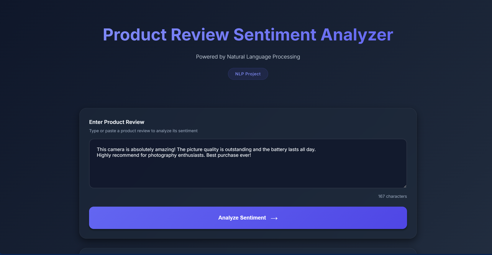
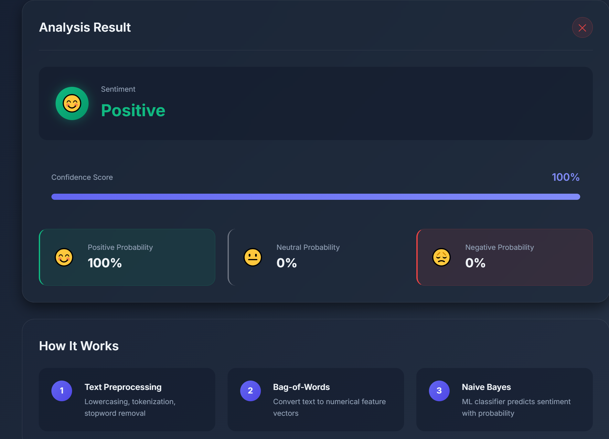
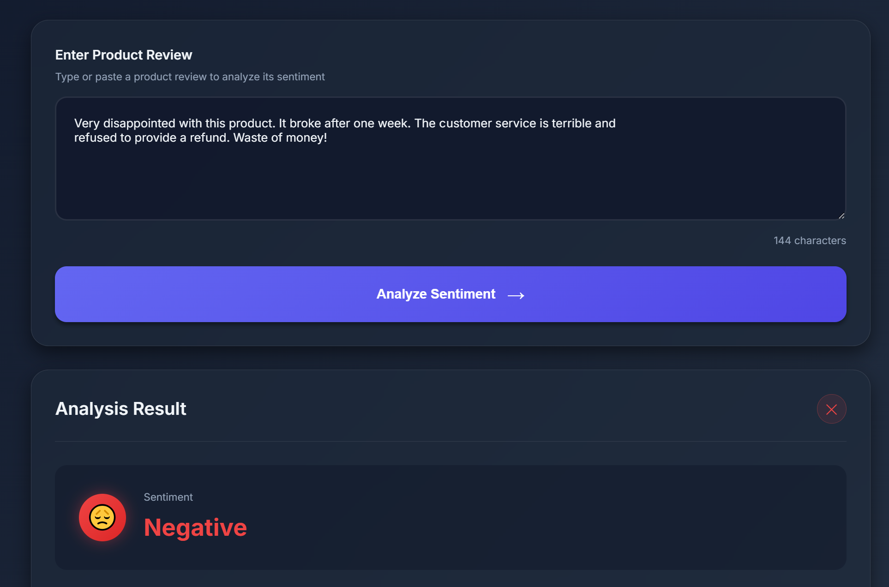
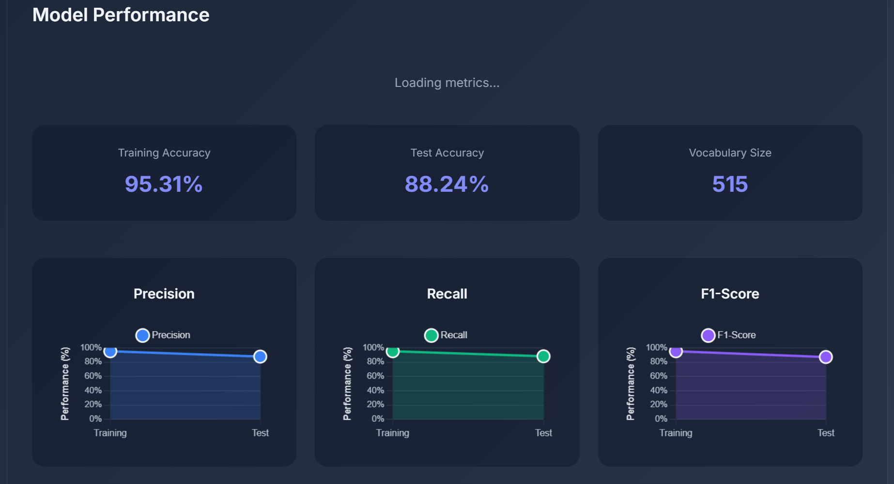

# Product Review Sentiment Analyzer
---

## Project Description

The **Product Review Sentiment Analyzer** is a Natural Language Processing (NLP) application that analyzes product reviews and predicts their sentiment (positive or negative). This project demonstrates core NLP concepts by implementing machine learning algorithms **from scratch without relying on external NLP libraries** like NLTK, spaCy, or scikit-learn.

### Key Features

- **Bag-of-Words (BoW) Vectorization**: Custom implementation of text-to-numerical vector conversion
- **Naive Bayes Classifier**: Multinomial Naive Bayes algorithm built from scratch
- **Text Preprocessing**: Comprehensive preprocessing including:
  - Tokenization
  - Stopword removal
  - Negation handling
  - HTML/URL sanitization
- **Web Interface**: Flask-based REST API with an interactive HTML/CSS/JavaScript frontend
- **Model Evaluation**: Custom metrics calculator (Accuracy, Precision, Recall, F1-Score, Confusion Matrix)
- **Production Ready**: Input validation, error handling, and logging capabilities

### Project Structure

```
├── app.py                          # Flask web application & API endpoints
├── nlp_core.py                     # Core NLP implementations (from scratch)
├── train_model.py                  # Model training script
├── requirements.txt                # Python dependencies
├── dataset/
│   └── reviews.csv                 # Training dataset (reviews + sentiment labels)
├── models/
│   ├── vocabulary.json             # Learned vocabulary (BoW)
│   ├── naive_bayes_model.json      # Trained model weights
│   └── metrics.json                # Training metrics
├── static/
│   ├── css/
│   │   └── style.css               # Frontend styling
│   └── js/
│       └── script.js               # Frontend JavaScript logic
├── templates/
│   └── index.html                  # Web interface
└── README.md                       # This file
```

## Team Members

| Name | Roll Number | 
|------|-------------|
| Afnan Abbas | 22SP-060-SE |
| Muhammad Imran | 22SP-009-SE |
| Abdul Basit Farooqui | 22SP-015-SE |
| Muhammad Jawad Hussian | 22SP-007-SE |


## Installation & Setup

### Prerequisites

- Python 3.8 or higher
- pip (Python package manager)

### Step 1: Clone the Repository

```bash
git clone <repository-url>
cd NLP
```

### Step 2: Install Dependencies

```bash
pip install -r requirements.txt
```

### Step 3: Verify Dataset

Ensure the dataset exists at `dataset/reviews.csv` with columns:
- `review`: Text of the product review
- `sentiment`: Label (1 for positive, 0 for negative)

### Step 4: Train the Model

```bash
python train_model.py
```

This script will:
- Load and preprocess the reviews dataset
- Split data into training (80%) and testing (20%) sets
- Build the Bag-of-Words vocabulary
- Train the Naive Bayes classifier
- Save the model and vocabulary to `models/` directory
- Display training metrics (Accuracy, Precision, Recall, F1-Score)

**Expected Output:**
```
Loading reviews from dataset/reviews.csv...
Loaded 5000 reviews

Training model...
BoW Vocabulary built: 5234 unique words
Model trained on 4000 samples

Testing model...
Test Accuracy: 85.5%
Precision: 0.87
Recall: 0.84
F1-Score: 0.855

✓ Model saved to models/naive_bayes_model.json
✓ Vocabulary saved to models/vocabulary.json
✓ Metrics saved to models/metrics.json
```

## Running the Application

### Start the Flask Web Server

```bash
python app.py
```

The server will start at `http://localhost:5000`

**Console Output:**
```
Loading trained model and vocabulary...
✓ Vocabulary loaded: 5234 words
✓ Model loaded: [0, 1]
✓ Metrics loaded
Model ready for predictions!

 * Running on http://localhost:5000
```

### Access the Web Interface

1. Open your browser and navigate to: **`http://localhost:5000`**
2. You'll see the Product Review Sentiment Analyzer interface
3. Enter or paste a product review in the text area
4. Click the **"Analyze Sentiment"** button
5. View the prediction result with confidence score

#### Home Screen

*Web interface showing the input area for product reviews*

### Example Reviews to Test

**Positive Review:**
```
This camera is absolutely amazing! The picture quality is outstanding and the battery lasts all day. 
Highly recommend for photography enthusiasts. Best purchase ever!
```
#### Positive Sentiment Analysis Result

*Example of a positive sentiment prediction with confidence score*


**Negative Review:**
```
Very disappointed with this product. It broke after one week. The customer service is terrible and 
refused to provide a refund. Waste of money!
```

#### Negative Sentiment Analysis Result

*Example of a negative sentiment prediction with confidence score*

## API Endpoints

### POST `/api/predict`

Predicts sentiment for a given review text.

**Request:**
```json
{
  "review": "This product exceeded my expectations. Excellent quality and fast shipping!"
}
```

**Response (Success):**
```json
{
  "sentiment": "Positive",
  "confidence": 0.92,
  "probabilities": {
    "Negative": 0.08,
    "Positive": 0.92
  },
  "processed_text": "product exceeded expectations excellent quality fast shipping"
}
```

**Response (Error):**
```json
{
  "error": "Review text cannot be empty"
}
```

#### Model Metric Evaluation



## Project Implementation Details

### Core Components

#### 1. **TextPreprocessor** (`nlp_core.py`)
- Tokenization with regex patterns
- Stopword removal (English stopwords)
- Negation handling (preserves "not", "no", etc.)
- Word length filtering
- Special character and URL removal

#### 2. **BagOfWordsVectorizer** (`nlp_core.py`)
- Vocabulary building from training data
- Text-to-vector conversion
- Word frequency calculation
- JSON serialization for model persistence

#### 3. **NaiveBayesClassifier** (`nlp_core.py`)
- Multinomial Naive Bayes implementation
- Prior probability calculation
- Conditional probability estimation with Laplace smoothing
- Prediction with confidence scoring
- Multi-class support (extensible)

#### 4. **MetricsCalculator** (`nlp_core.py`)
- Accuracy calculation
- Precision, Recall, F1-Score computation
- Confusion matrix generation
- Per-class and weighted metrics

### Machine Learning Pipeline

```
Review Text
    ↓
[Preprocessing] → Tokenization → Stopword Removal → Negation Handling
    ↓
[Vectorization] → Bag-of-Words Vector
    ↓
[Classification] → Naive Bayes → Prediction + Confidence
    ↓
Sentiment (Positive/Negative)
```

## Configuration Parameters

### In `app.py`

```python
MAX_INPUT_LENGTH = 5000          # Maximum characters allowed per review
MIN_CONFIDENCE_THRESHOLD = 0.6   # Minimum confidence for definitive prediction
```

### In `nlp_core.py` (TextPreprocessor)

```python
remove_stopwords = True          # Enable stopword removal
min_word_length = 2              # Minimum word length filter
handle_negation = True           # Enable negation handling
```

## Troubleshooting

### Issue: "Model files not found"
**Solution**: Run `python train_model.py` to train and save the model first.

### Issue: Port 5000 already in use
**Solution**: Either stop the application using that port or modify the port in `app.py`:
```python
if __name__ == '__main__':
    app.run(debug=True, port=8080)  # Change to a different port
```

### Issue: Incorrect predictions
**Possible causes**:
- Dataset is imbalanced or too small
- Model needs retraining with more/better data
- Review text contains domain-specific vocabulary not in training data

**Solution**: Collect more diverse training data and retrain the model.

## File Descriptions

| File | Purpose |
|------|---------|
| `app.py` | Flask application with REST API endpoints and request handling |
| `nlp_core.py` | Core NLP implementations (preprocessing, vectorization, classification) |
| `train_model.py` | Training pipeline and model persistence |
| `requirements.txt` | Python package dependencies |
| `dataset/reviews.csv` | Training and evaluation dataset |
| `models/naive_bayes_model.json` | Serialized trained model |
| `models/vocabulary.json` | Learned vocabulary from training data |
| `models/metrics.json` | Model performance metrics |
| `templates/index.html` | Web interface HTML |
| `static/css/style.css` | Frontend styling |
| `static/js/script.js` | Frontend interactivity |

## Technologies Used

- **Python 3.8+**: Core programming language
- **Flask**: Web framework for REST API
- **Flask-CORS**: Cross-Origin Resource Sharing support
- **HTML5/CSS3/JavaScript**: Frontend interface
- **JSON**: Data serialization for models
- **CSV**: Dataset format

## Learning Outcomes

This project demonstrates proficiency in:

✅ Natural Language Processing fundamentals  
✅ Machine Learning algorithms from scratch  
✅ Text preprocessing and feature engineering  
✅ Probability theory and statistical methods  
✅ Web development with Flask  
✅ Model persistence and serialization  
✅ REST API design and implementation  
✅ Frontend-backend integration  
✅ Software engineering best practices  

## Notes

- This project implements NLP algorithms **from scratch** to understand core concepts
- No scikit-learn, NLTK, or spaCy libraries are used for NLP tasks
- The model uses Multinomial Naive Bayes which assumes conditional independence of features
- For production use, consider more sophisticated models like Deep Learning approaches
- Dataset quality significantly impacts model performance

## Future Enhancements

- [ ] Multi-class sentiment analysis (Positive, Negative, Neutral)
- [ ] Aspect-based sentiment analysis
- [ ] Real-time model retraining capability
- [ ] Support for multiple languages
- [ ] Deployment to cloud platforms (Heroku, AWS, etc.)
- [ ] Advanced visualization of word importance
- [ ] Integration with product databases

## License

This project is created for educational purposes as part of the NLP course (Semester VIII).

---

**For any questions or issues, please contact the team members listed above.**
